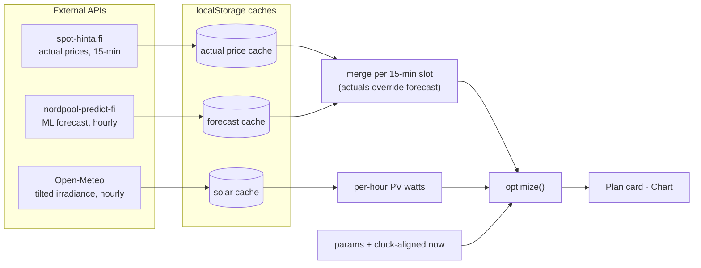
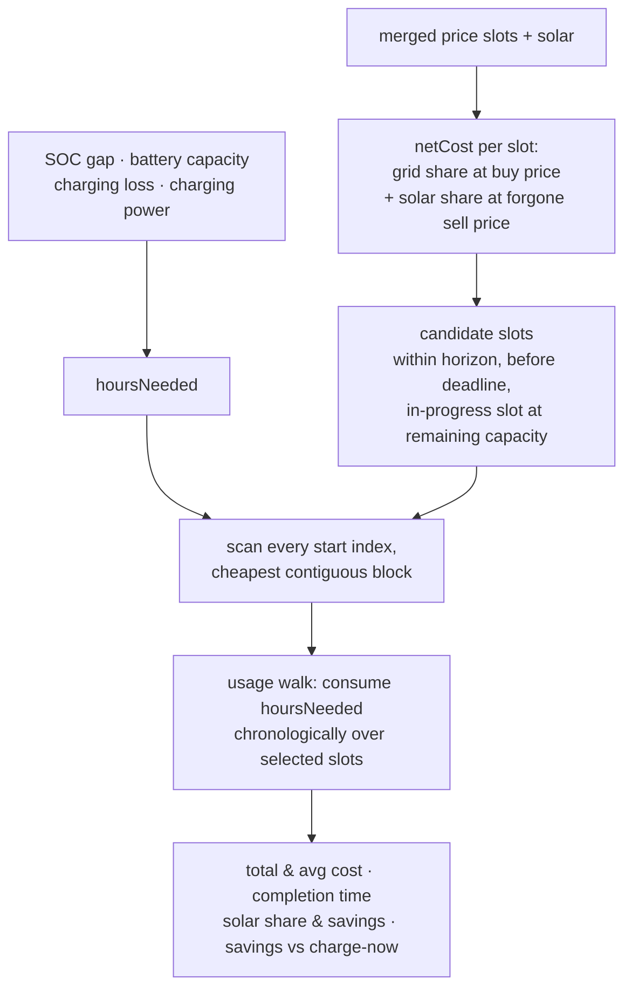
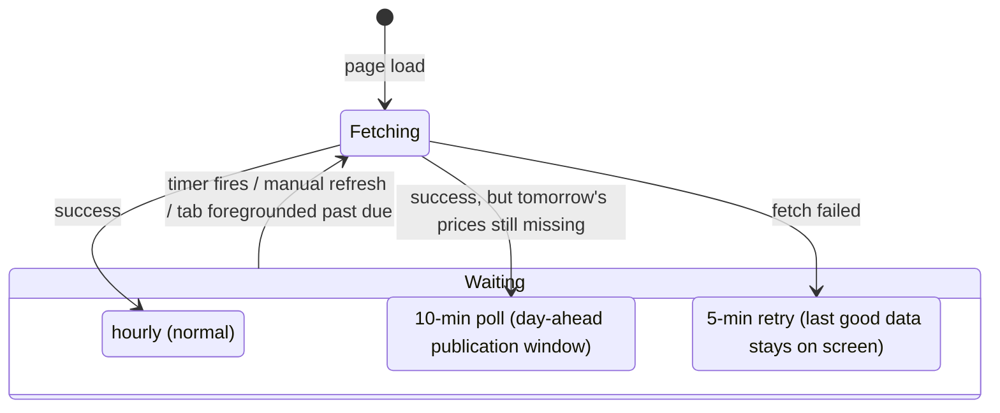

# EV Charging Optimizer

[](https://github.com/ltpk/charging-optimizer/actions/workflows/ci.yml)
[](https://github.com/ltpk/charging-optimizer/actions/workflows/deploy.yml)
[](https://react.dev)
[](https://www.typescriptlang.org)
[](https://vite.dev)
[](https://bun.sh)

**Live: https://ltpk.github.io/charging-optimizer/**

Finds the cheapest hours to charge an EV based on Finnish electricity spot prices, with optional solar production offset. Built for personal use.

## Features

- **15-minute resolution** end to end: actual spot prices from [spot-hinta.fi](https://spot-hinta.fi) (today + tomorrow) are used at their native quarter-hour market-time-unit resolution, so the plan catches price dips inside an hour; [nordpool-predict-fi](https://github.com/vividfog/nordpool-predict-fi) ML forecasts (hourly) fill the uncovered hours as flat quarters
- Optional solar production forecast from [Open-Meteo](https://open-meteo.com) — global tilted irradiance (GTI) for your panel tilt/azimuth, converted to PV output (`kWp × GTI/1000 × 0.85` performance ratio) to offset charging cost when solar covers part of charging power
- Finds the cheapest **consecutive** charging window over 15-min slots — accounting for the partially elapsed current slot (charging can start mid-slot; a slot with under ~4 minutes left is skipped)
- Optional **charge-by deadline** — constrains the search window to complete charging before a given hour (e.g. by 07:00); warns when the deadline is too tight to reach the target SOC, or when it has already passed
- Configurable battery capacity, charging loss, grid transfer fees, and buy/sell margins (Finnish VAT 25.5% applied correctly). Charging power is derived from a 1-/3-phase selection, charge current, and voltage, capped by the car's onboard charger; a read-only panel shows the resulting charging speed (%/hr), charging power, energy to battery, and (when there's loss) grid power and energy from grid
- The answer comes first: a plan card at the top shows whether to charge now or when to start (e.g. "Start at 02:15 tomorrow", with time remaining), then when charging is done (hours and kWh), the estimated cost with average c/kWh (and how much of it is transfer fee), how much waiting saves vs. charging straight through from now, and — when solar is enabled — the % of the charge covered by solar and the € it saves vs. grid-only (on negative spot prices this flips to "adds … € (negative spot)", since self-consuming solar then forfeits being paid to draw from the grid). A footer line shows the current slot's spot price, its net cost (the figure the optimizer actually ranks by), transfer fee and solar output. Savings percentages are dropped — leaving just the € amount — when the baseline they measure against is under 0.01 €, since negative spot prices can push it through zero. Once the card scrolls out of view, a compact summary stays visible in the sticky top bar
- Price chart plots quarter-hour prices as stepped lines (a price holds for its 15-min slot) with hourly axis labels and a smoothed solar curve; shaded windows, the night-rate step, and the "now" line (at the elapsed fraction of the current slot) all align with actual clock times. On phones the chart scrolls horizontally at a fixed per-hour width — opening at the "now" line — so a 48/72 h horizon stays readable instead of being squeezed into the viewport
- Optional browser notification when the charging window starts (in-tab; enable in the sidebar)
- Light/dark/system theme: a single AppBar button cycles system → light → dark; follows `prefers-color-scheme` by default and remembers your choice
- Mobile-responsive layout: everyday controls (battery SOC, search window, charge-by) sit in an inline sidebar on desktop and a bottom sheet on mobile, where the SOC sliders sit as a card in the main view instead so adjusting them doesn't cover the plan they update; set-once config (vehicle, transfer fee, margins, solar) lives in a separate "Vehicle & pricing setup" dialog (full-screen on phones) with a "Restore defaults" button, and info tooltips explain the less obvious fields. The price chart spans the full width, labels the charging window's start time and scrolls horizontally on phones
- All data cached in `localStorage`; prices refresh hourly — every 10 minutes during the ~14:00 day-ahead publication window until tomorrow's prices arrive — or on demand via the refresh button (a failed refresh keeps the last good data on screen and retries after 5 minutes; a backgrounded tab whose timers were throttled catches up the moment it becomes visible again). The solar forecast caches for the local calendar day and refetches automatically on load and just after midnight while solar is enabled; changing location or panel parameters prompts a manual refetch
- The "now" marker, current-slot status, and optimal window advance on each quarter hour automatically (and when the tab regains focus), without needing a data refresh

## How it works

Three views of the moving parts. The diagrams show topology — what feeds what and where the boundaries are; exact constants and cache keys live in [Features](#features) and the code.

### Data pipeline

Two price sources merge into one 15-minute slot series (actual prices always win over forecasts), solar arrives independently, and everything meets in the pure `optimize()` core:



### Optimizer

`optimize()` turns the SOC gap into hours of charging needed, prices every candidate slot with `calcNetCost()` (the grid share at buy price **plus** the solar share at the forgone sell price), picks slots per the chosen mode, and derives the reported numbers from a chronological usage walk:



### Price refresh cadence

One fetch loop with three waiting speeds; a manual refresh or a tab returning to the foreground past its due time short-circuits any of them:



## Development

```bash
bun install       # uses the committed bun.lock
bun run dev       # http://localhost:5173
bun run build     # production build → dist/
bun run preview   # serve dist/ locally
bun run typecheck # tsc --noEmit
bun test          # unit tests (optimization core + pure api helpers)
```

Performance: the price chart (Chart.js) is lazy-loaded via `React.lazy`/`Suspense`, so it splits into its own bundle chunk (~58 kB gzip) and loads after first paint instead of blocking the initial load. React and MUI are split into their own vendor chunks (`vite.config.ts` `manualChunks`) so they stay cached across deploys while only the small app chunk re-downloads. The price fetch is kicked off at module load (`prewarmPrices()` in `main.tsx`) so the network round-trip overlaps with bundle parse/execute, and `index.html` preconnects to the spot-price API. The favicon is an inline SVG data-URI (lightning bolt) in `index.html` — no extra request and no path to break under the Pages subpath.

Commits run a Husky pre-commit hook: Prettier (via lint-staged on staged files), then `bun run typecheck`, then `bun test`.

No environment variables or API keys required — all APIs are public.

## Configuration

Everyday parameters are set in the sidebar, set-once ones in the "Vehicle & pricing setup" dialog; all are persisted automatically. Key inputs:

| Parameter                  | Description                                                                                                                 |
| -------------------------- | --------------------------------------------------------------------------------------------------------------------------- |
| SOC now / target           | Current and desired battery state of charge (%)                                                                             |
| Battery capacity           | Usable kWh                                                                                                                  |
| Charging loss              | Round-trip loss (%) — energy drawn from grid exceeds energy stored                                                          |
| Onboard charger            | Car's max AC power (kW) — caps grid power                                                                                   |
| Phases / current / voltage | 1- or 3-phase, charge current (A), and grid voltage (V); grid power = min(phases × A × V, onboard charger)                  |
| Charge by                  | Optional deadline — optimizer only uses slots that complete before this hour-of-day                                         |
| Transfer fee               | Grid transfer fee (c/kWh); toggle on/off, choose a single fixed fee or separate day/night rates (night applies 22:00–07:00) |
| Buy margin                 | Retailer margin on purchases (c/kWh, VAT-exclusive)                                                                         |
| Sell margin                | Deducted from spot when calculating solar sell-back value                                                                   |
| Search window              | How many hours ahead to search for the optimal window                                                                       |
| Solar PV (enable)          | Toggle solar influence on/off without losing panel configuration                                                            |
| Base consumption           | House base load (W) served by solar first; only surplus solar offsets charging (default 0 = all solar available)            |

## Solar setup

1. Set your location — click **Get GPS location** or type latitude/longitude into the fields directly (the manual fields also cover denied location permission or desktops without a location service)
2. Set panel tilt, azimuth (compass degrees: 0 = N, 90 = E, 180 = S, 270 = W — converted automatically to Open-Meteo's 0 = S convention), and peak power (kWp)
3. Optionally set **Base consumption** (W) — other household load (fridge, standby, heat pump, …) that consumes solar before any reaches the charger, so only the surplus offsets charging cost
4. The forecast is fetched automatically once solar is enabled with a valid location, and again each new day; **Fetch solar forecast** forces a refetch — needed after changing location or panel parameters (the status line warns when the on-screen forecast no longer matches the settings)

## APIs used

| API                                   | Purpose                                                                     | Cache                                                         |
| ------------------------------------- | --------------------------------------------------------------------------- | ------------------------------------------------------------- |
| `api.spot-hinta.fi/today`             | Actual spot prices, 15-min slots (VAT applied to the untaxed price locally) | Re-fetched until tomorrow's prices are available, then stable |
| `api.spot-hinta.fi/dayforward`        | Tomorrow's prices (available ~14:15)                                        | Same                                                          |
| `nordpool-predict-fi` prediction.json | Hourly ML forecast for unpriced hours                                       | 1 h TTL                                                       |
| `api.open-meteo.com` GTI              | Global tilted irradiance → PV production estimate                           | Calendar day                                                  |
